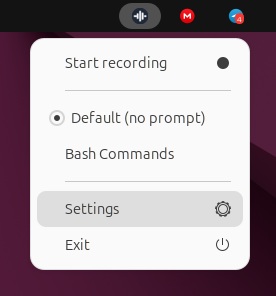
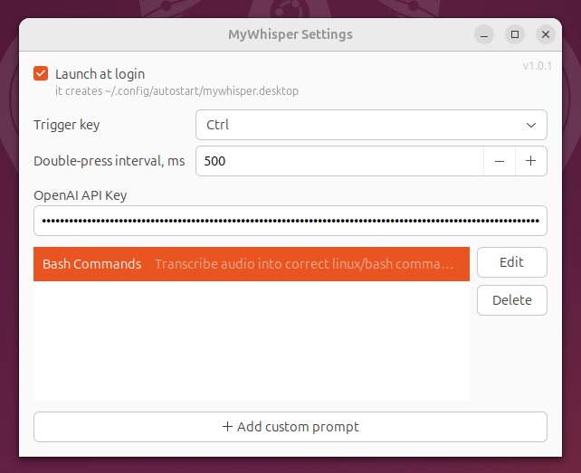

 


# mywhisper-gtk

Minimalist Whisper for voice input in different Linux applications, including terminal apps.

Transcription is powered by the `gpt-transcribe` model.

Tested on Ubuntu 24.04 with an X11 server.

## Run

Install packages required to run the app:

```bash
sudo apt update
sudo apt install -y alsa-utils ffmpeg
```

Run:

```bash
./app.out
```

Set `OpenAI API Key` in app settings (`Settings` in tray menu).

## Build

Install packages required to build:

```bash
sudo apt update
sudo apt install -y build-essential pkg-config libgtk-3-dev libayatana-appindicator3-dev libx11-dev libxtst-dev libsoup-3.0-dev
```

Build:

```bash
make build
```

## Screenshots






## Hotkeys

| Hotkey | Action |
|---|---|
| Double `Ctrl` / `Shift` / `Alt` | Start/stop voice input; key and interval are configurable in settings |
| `Esc` (during voice input) | Cancel |
